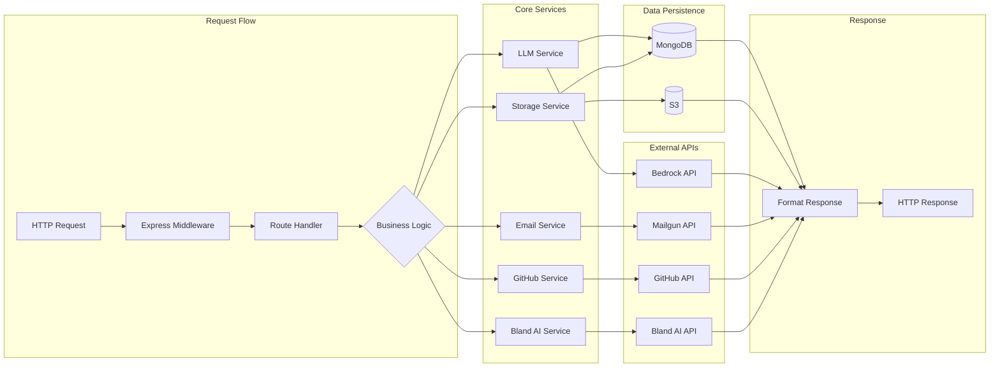
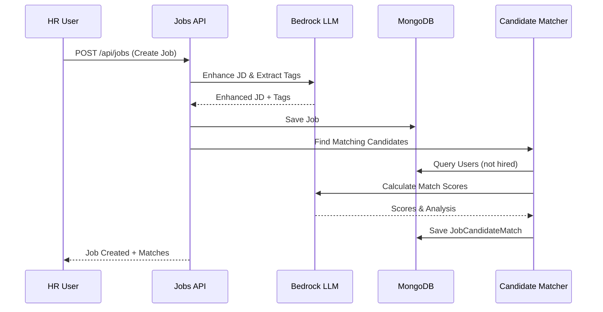
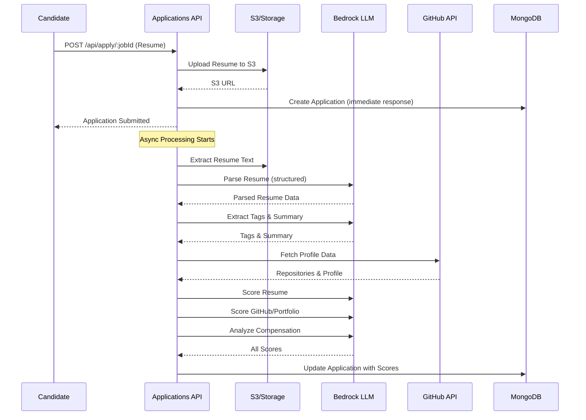
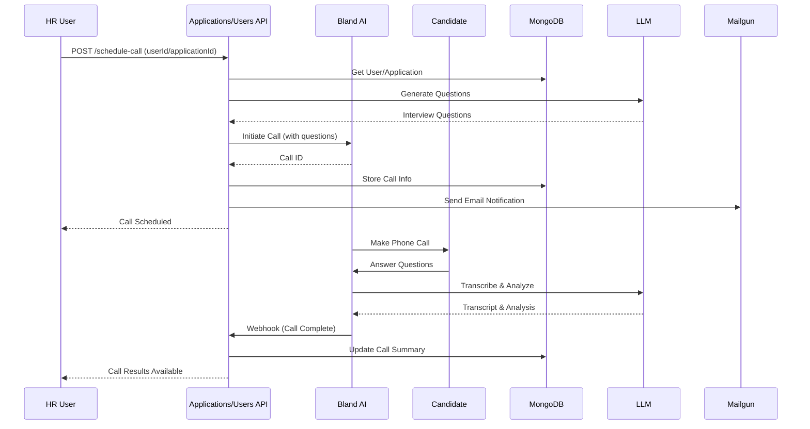
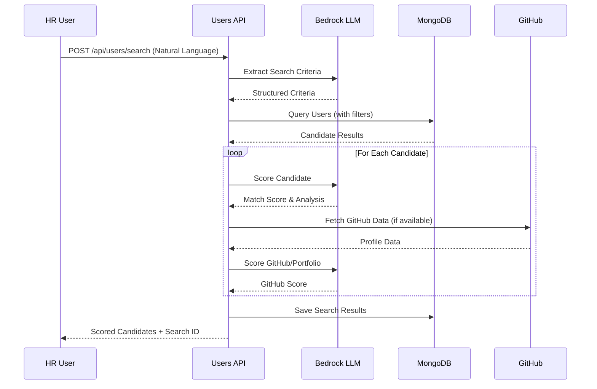
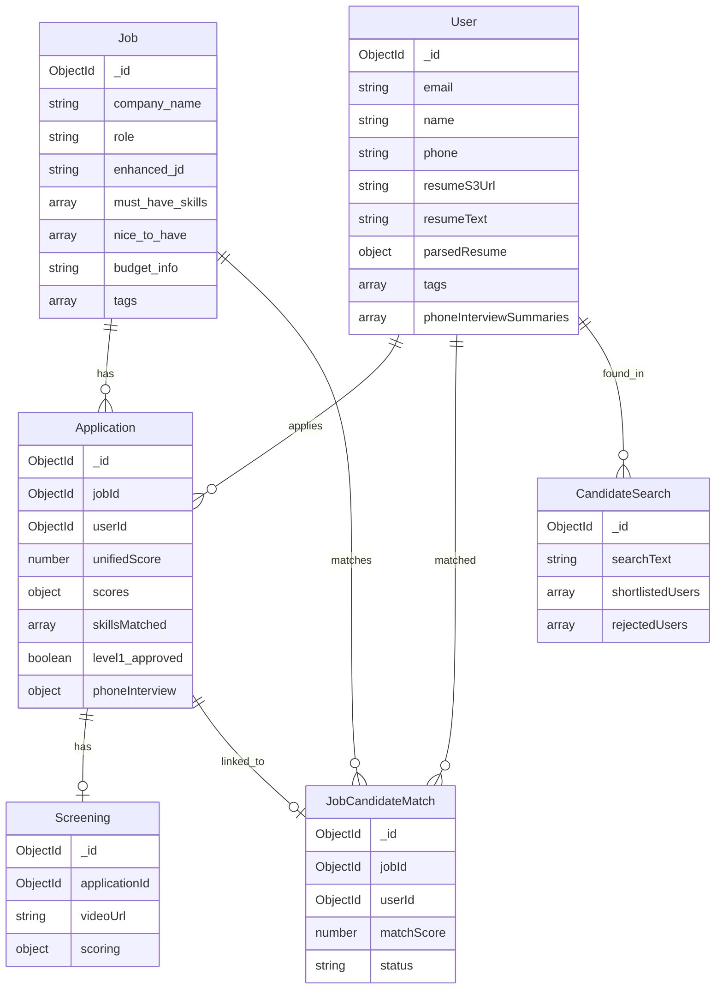

# HireWise AI - System Architecture

## High-Level Architecture Diagram

```mermaid
graph TB
    subgraph "Client Layer"
        HR[HR Dashboard]
        Candidate[Candidate Portal]
    end

    subgraph "API Layer - Express.js"
        JobsAPI[Jobs API<br/>/api/jobs]
        ApplicationsAPI[Applications API<br/>/api/applications]
        UsersAPI[Users API<br/>/api/users]
        ScreeningsAPI[Screenings API<br/>/api/screenings]
        AnalysisAPI[Analysis API<br/>/api/analysis]
        EmailAPI[Email API<br/>/api/email]
    end

    subgraph "Business Logic Layer"
        JDEnhancer[JD Enhancer]
        CandidateMatcher[Candidate Matcher]
        ResumeParser[Resume Parser]
        ScoreCalculator[Score Calculator]
    end

    subgraph "AI/LLM Services"
        BedrockAPI[Amazon Bedrock API<br/>Claude 3.5 Sonnet/Opus]
        EmbeddingsAPI[Titan Embeddings]
        BlandAI[Bland AI<br/>Voice Interviews]
    end

    subgraph "Data Layer"
        MongoDB[(MongoDB<br/>Primary Database)]
        S3[(AWS S3<br/>Resume Storage)]
    end

    subgraph "External Services"
        GitHubAPI[GitHub API<br/>Profile Analysis]
        Mailgun[Mailgun<br/>Email Service]
    end

    subgraph "Data Models"
        JobModel[Job Model]
        UserModel[User Model]
        ApplicationModel[Application Model]
        ScreeningModel[Screening Model]
        MatchModel[JobCandidateMatch Model]
        SearchModel[CandidateSearch Model]
    end

    %% Client to API connections
    HR --> JobsAPI
    HR --> ApplicationsAPI
    HR --> UsersAPI
    HR --> ScreeningsAPI
    HR --> AnalysisAPI
    HR --> EmailAPI
    Candidate --> ApplicationsAPI

    %% API to Business Logic
    JobsAPI --> JDEnhancer
    JobsAPI --> CandidateMatcher
    ApplicationsAPI --> ResumeParser
    ApplicationsAPI --> ScoreCalculator
    UsersAPI --> CandidateMatcher
    ScreeningsAPI --> ScoreCalculator

    %% Business Logic to AI Services
    JDEnhancer --> BedrockAPI
    CandidateMatcher --> BedrockAPI
    CandidateMatcher --> EmbeddingsAPI
    ResumeParser --> BedrockAPI
    ScoreCalculator --> BedrockAPI
    ApplicationsAPI --> BlandAI
    UsersAPI --> BlandAI

    %% API to External Services
    ApplicationsAPI --> GitHubAPI
    UsersAPI --> GitHubAPI
    EmailAPI --> Mailgun
    ApplicationsAPI --> Mailgun
    UsersAPI --> Mailgun

    %% API to Data Layer
    JobsAPI --> MongoDB
    ApplicationsAPI --> MongoDB
    UsersAPI --> MongoDB
    ScreeningsAPI --> MongoDB
    ApplicationsAPI --> S3
    UsersAPI --> S3

    %% Data Models
    MongoDB --> JobModel
    MongoDB --> UserModel
    MongoDB --> ApplicationModel
    MongoDB --> ScreeningModel
    MongoDB --> MatchModel
    MongoDB --> SearchModel

    %% Webhooks
    BlandAI -.->|Webhook| ApplicationsAPI
    BlandAI -.->|Webhook| UsersAPI

    style BedrockAPI fill:#ff6b6b
    style BlandAI fill:#4ecdc4
    style MongoDB fill:#45b7d1
    style S3 fill:#f9ca24
    style Mailgun fill:#6c5ce7
```

## Detailed Component Architecture

## Data Flow Diagrams

### Job Creation & Candidate Matching Flow

### Application & Scoring Flow

### Phone Interview Flow

### Candidate Search Flow

## Database Schema Relationships

## Technology Stack

### Backend
- **Runtime**: Node.js (ES Modules)
- **Framework**: Express.js
- **Database**: MongoDB with Mongoose ODM
- **File Storage**: AWS S3

### AI/ML Services
- **LLM**: Amazon Bedrock (Claude 3.5 Sonnet, Opus, Haiku)
- **Embeddings**: Amazon Bedrock Titan Embeddings
- **Voice AI**: Bland AI (Phone Interviews)

### External Services
- **Email**: Mailgun API
- **Version Control**: GitHub API (for profile analysis)

### Key Libraries
- `mongoose` - MongoDB ODM
- `@aws-sdk/client-s3` - S3 integration
- `@aws-sdk/s3-request-presigner` - Presigned URLs
- `pdf-parse` - PDF text extraction
- `mailgun.js` - Email service
- `multer` - File upload handling

## Key Features & Endpoints

### Job Management
- `POST /api/jobs` - Create job with JD enhancement
- `GET /api/jobs/:id` - Get job details
- `POST /api/jobs/extract-fields` - Extract job fields from text

### Application Management
- `POST /api/apply/:jobId` - Submit application (async scoring)
- `GET /api/applications/job/:jobId` - Get all applications for a job
- `POST /api/applications/:id/approve-level1` - Approve candidate
- `POST /api/applications/:id/reject` - Reject candidate
- `POST /api/applications/:id/schedule-call` - Schedule phone interview

### User Management
- `GET /api/users/:id` - Get user profile
- `POST /api/users/search` - AI-powered candidate search
- `POST /api/users/:userId/schedule-call` - Schedule call (no application)
- `GET /api/users/:id/resume` - Download resume (presigned URL)

### Phone Interviews
- `POST /api/applications/:id/schedule-call` - Schedule/initiate call
- `GET /api/applications/:id/phone-call-status` - Get call status
- `POST /api/applications/:id/webhook` - Bland AI webhook handler

### Email Service
- `POST /api/email/send` - Send single email
- `POST /api/email/send-bulk` - Send bulk emails

## Security & Best Practices

1. **Environment Variables**: All sensitive data stored in `.env`
2. **Presigned URLs**: Secure S3 file access with expiration
3. **Input Validation**: Request validation and sanitization
4. **Error Handling**: Comprehensive error handling middleware
5. **Async Processing**: Heavy LLM operations run asynchronously
6. **Null Safety**: Null checks for all database references

## Deployment Considerations

- **Database**: MongoDB Atlas or self-hosted
- **Storage**: AWS S3 (configurable region)
- **API**: Railway, Heroku, AWS EC2, or similar
- **Environment**: Production `.env` with all required keys
- **Webhooks**: Public URL required for Bland AI callbacks (ngrok for local dev)
